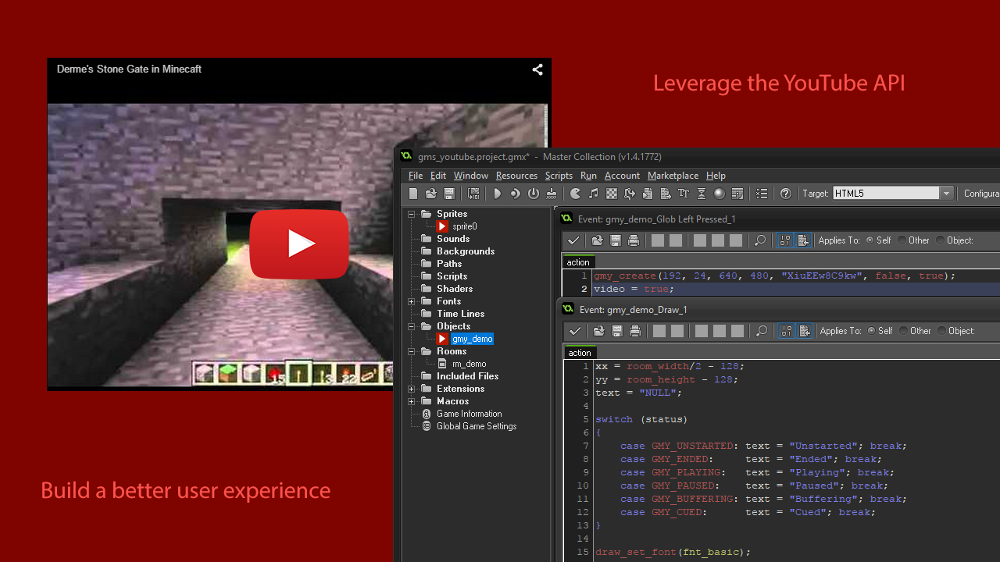

# GMY YouTube Pro
*May not be compatible with GameMaker 2+*

This extension allows access to the YouTube API functions with the HTML5 export. This allows you to know exactly what state the video is in (playing, paused, ended). This means that you know when to resume the gameplay as you can find out when the video has finished.

## Features:

* Play any YouTube Video
* Auto-remove the video when it's finished
* Allows the video to be autoplayed

